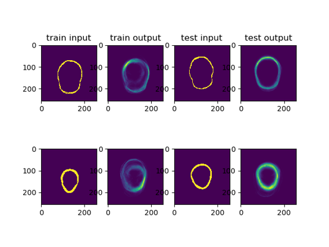
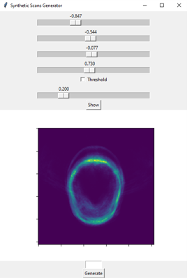

# Synthetic Skull Scans
A simple autoencoder for generating synthetic CT scans of skulls.

This work currently only contains a working framework for 2d slices and lacks practically useful performance. 

It is optimized for the CERMEP dataset:
CERMEP-IDB-MRXFDG: a database of 37 normal adult human brain [18F]FDG PET, T1 and FLAIR MRI,
and CT images available for research. Mérida, I., Jung, J., Bouvard, S. et al. EJNMMI Res 11, 91 (2021).
https://doi.org/10.1186/s13550-021-00830-6

In order to improve the model, consider:
- Acquiring more data
- Augmenting the data
  - Shifting
  - Rotating
- Increasing complexity
  - larger layers
  - more layers
- Replacing the autoencoder by a Generative Adversarial Network
